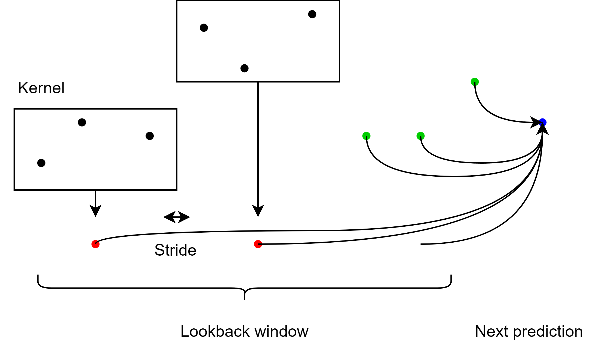
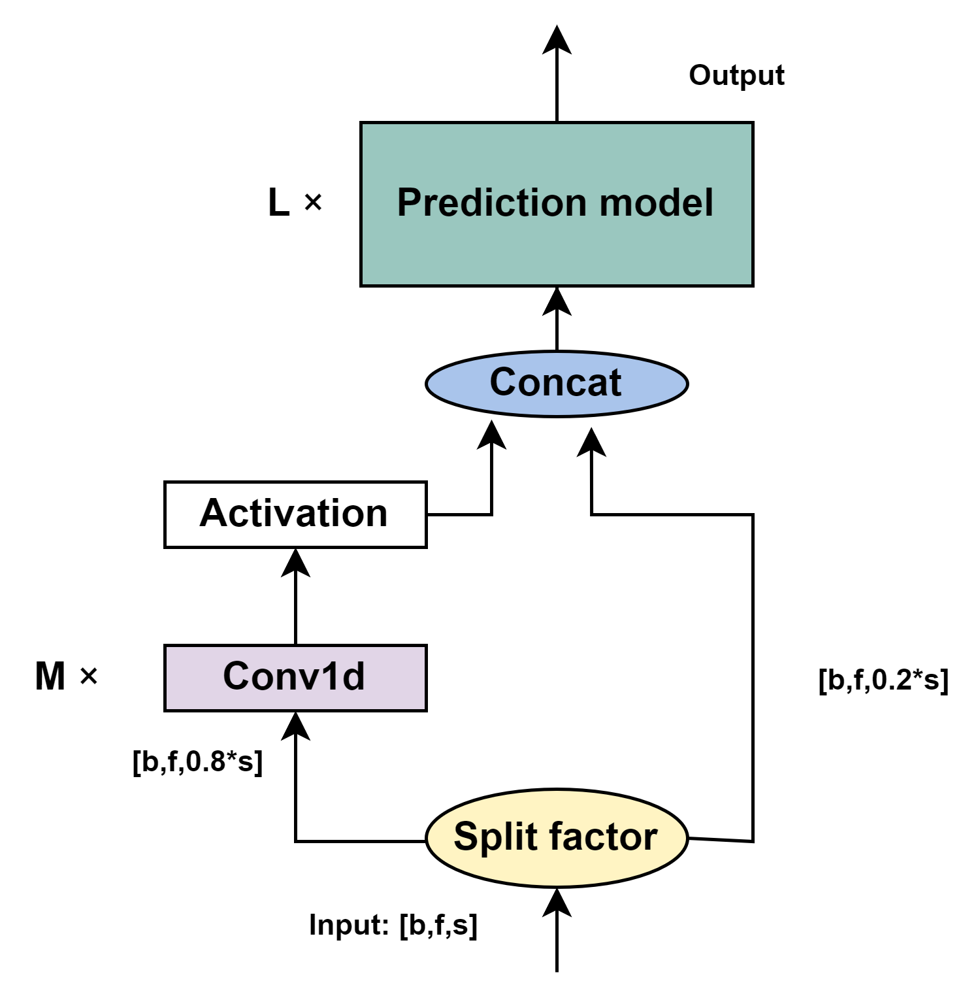

# TCformer: Temporal Convolution Transformer

This repository contains the code and experiments for the paper titled "To what extent can the incorporation of Temporal Convolution into Transformer Improve the Efficiency of Time Series Prediction?"

## Overview



TCformer is a novel architecture that integrates Temporal Convolution (CNN) with Transformer models to enhance the efficiency and precision of time series prediction tasks. By preprocessing input data with convolutional layers, TCformer captures general trends and reduces model size while maintaining high performance.




## Key Features

- **Hybrid Architecture**: Combines the strengths of CNNs and Transformers.
- **Efficiency**: Reduces sequence length to improve computational efficiency.
- **Flexibility**: Allows customization of split factors, CNN layers, and prediction models.


## Methodology

- **Architecture**: Utilizes CNN to "summarize" input data, reducing sequence length before processing with a Transformer.
- **Attention Mechanism**: Adapts the attention mechanism to focus on both summarized and raw data points.
- **Sequence Reduction**: Achieves significant parameter reduction while maintaining accuracy.

## Experiments

Experiments demonstrate that TCformer consistently outperforms standard Transformer models, particularly in single-step prediction tasks, while also offering improved computational efficiency.

## Conclusion

TCformer successfully addresses limitations in existing models by incorporating temporal convolution, offering a flexible and efficient solution for time series prediction.

## Installation

Clone the repository:
 ```bash
 git clone https://github.com/yourusername/TCformer.git
 ```

Run the experiments using the provided scripts (in Linux environment):
```bash
bash src/experiments/seq2seq/scripts/boost_performance/iTransformer1dSplit-compare.sh
```
## Data


The data used in the experiments are mainly from the `iTransformer` repository. You can find it here: https://github.com/thuml/iTransformer

For the Chinese stock data, it's downloaded using the [BaoStock API](http://baostock.com/baostock/index.php/%E9%A6%96%E9%A1%B5)

The AMD stock data is downloaded from [Yahoo Finance](https://finance.yahoo.com/quote/AMD/history?p=AMD).