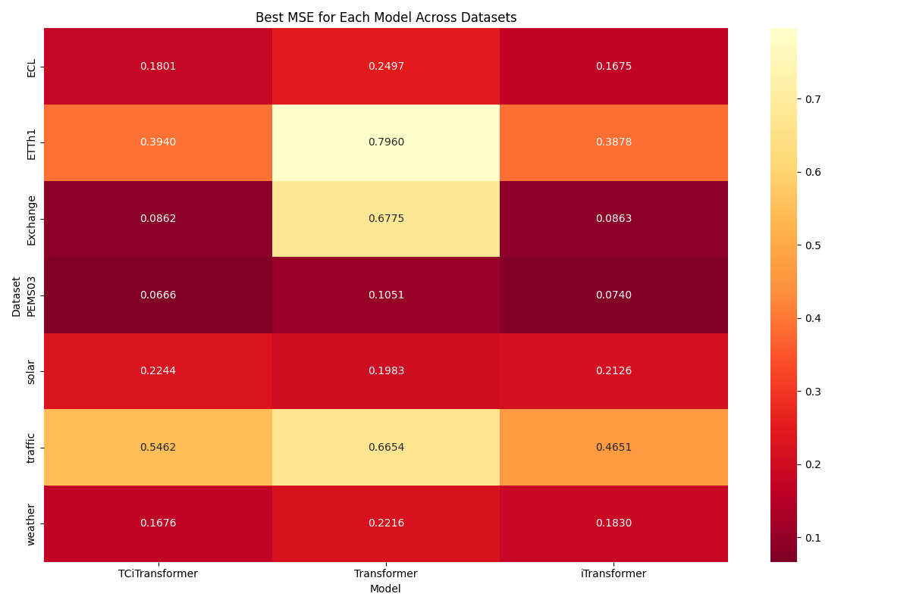

# Seq2Seq Experiments on TC

This directory is based on the repository https://github.com/thuml/iTransformer

We experimented the model on the datasets iTransformer used for seq2seq task. The `TCformer1dSplit` is the implementation of `Transformer` with `TCformer` architecture using Conv1d layer, while `TCformer2dSplit` uses Conv2d. `iTransformer1dSplit` is the implementation of `iTransformer` with `TCformer` architecture using Conv1d layer.

The main results in heatmap are shown below:
